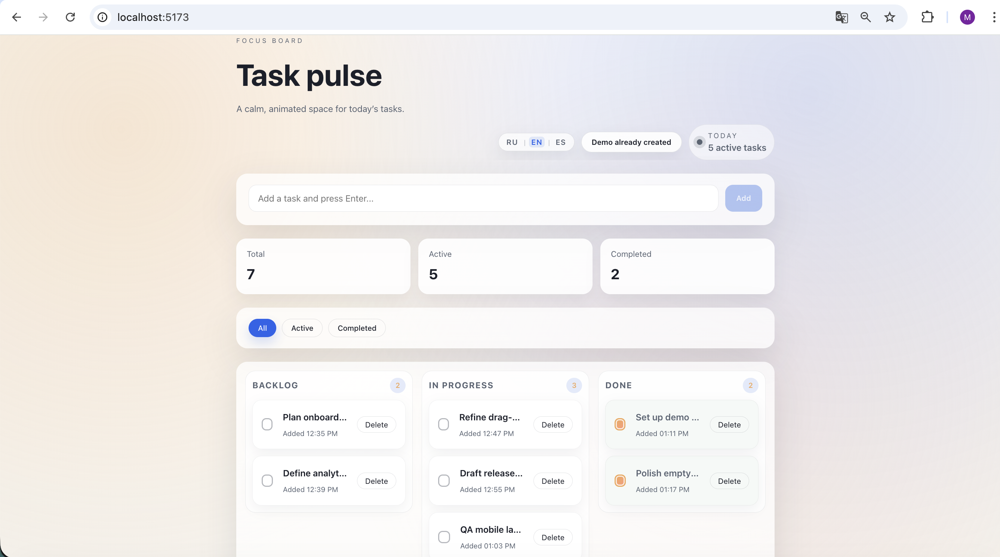
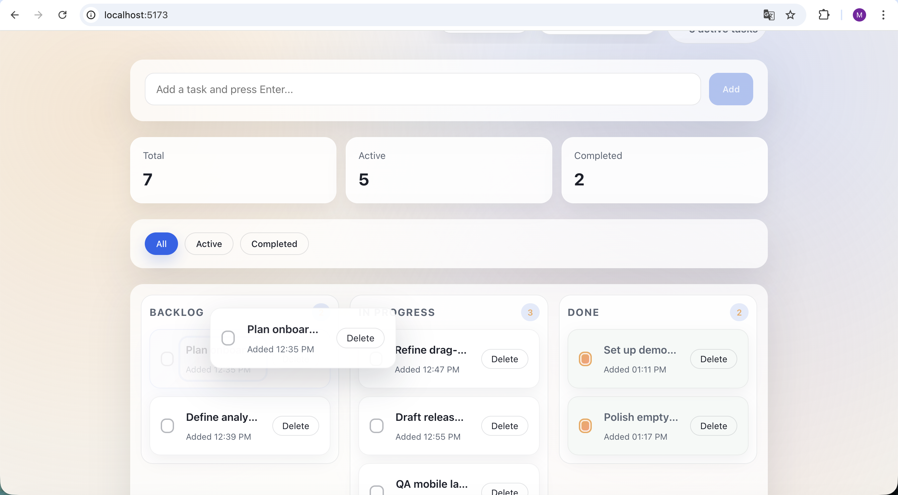
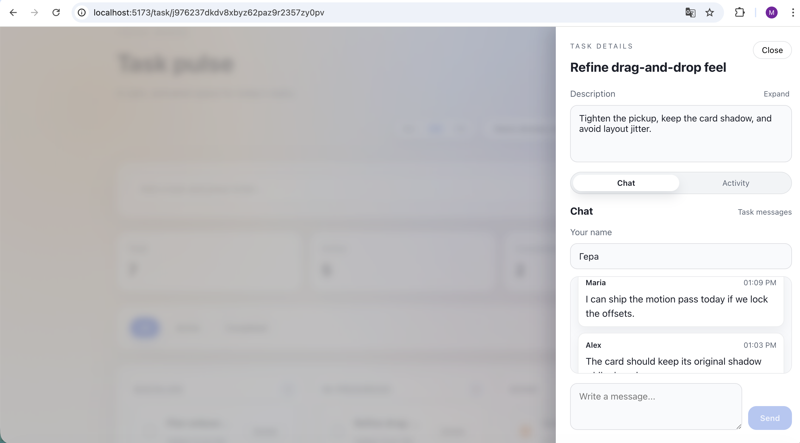
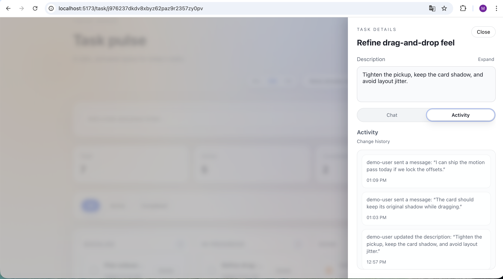
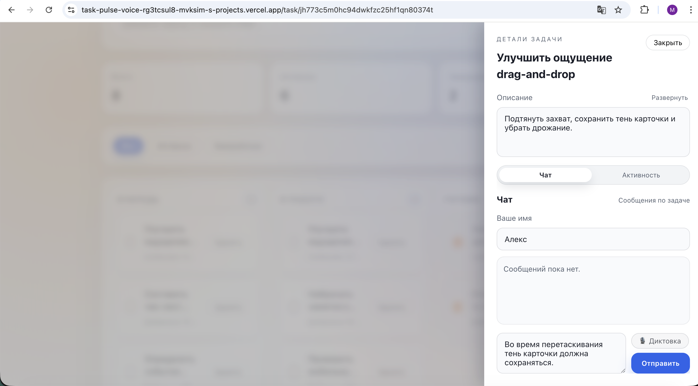
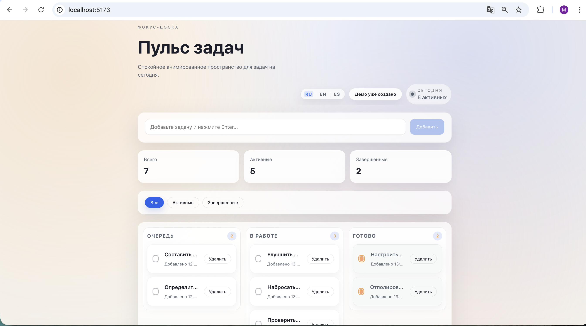

# 🚀 Task Pulse

**Task Pulse** — demo-first task management приложение с фокусом на UX, realtime-взаимодействие и чистую архитектуру.

Проект задуман как **showcase**: его можно открыть, нажать одну кнопку и сразу понять, как он работает — **без регистрации и настройки**.

👉 **Live demo (Vercel):** https://task-pulse-voice.vercel.app  
👉 **Локальный адрес:** http://localhost:5173

---

## ✨ Features

- 🧩 **Kanban-доска** (Backlog / In Progress / Done)
- 🖱️ **Drag & Drop** между колонками с плавной анимацией
- 📝 **Детали задачи** с встроенным чатом
- 🕒 **Activity timeline** (история изменений задачи)
- 🚀 **Demo-режим** (один клик — и всё заполнено)
- 🌍 **Мультиязычный интерфейс** (RU / EN / ES)
- 📱 **Адаптивный layout** (desktop → mobile)
- 🎙 **Голосовая диктовка** сообщений в чате (speech-to-text)

---

## 🖼️ Screenshots

### Kanban board


### Drag & Drop


### Task details — Chat


### Task details — Activity


### Voice dictation (Speech-to-Text)


### i18n (Russian)


---

## 🎙 Voice dictation (SpeechCoreAI)

В чате задачи доступна кнопка **«🎙 Диктовка»**, позволяющая надиктовать сообщение голосом.

Как работает:
1. Пользователь нажимает **«🎙 Диктовка»** в чате задачи.
2. Разрешает доступ к микрофону и диктует текст.
3. Аудио отправляется на serverless endpoint `/api/stt`.
4. Endpoint проксирует запрос в **SpeechCoreAI**.
5. Расшифрованный текст автоматически вставляется в чат.

🔐 **Важно:**  
API-токен SpeechCoreAI хранится **только на сервере** (Vercel serverless) и **никогда не попадает в браузер**.

---

## 🚀 Demo flow (recommended)

Рекомендуемый сценарий знакомства с приложением:

1. Открыть приложение  
2. Нажать **«Создать демо-данные»**  
3. Изучить заполненную Kanban-доску  
4. Перетащить задачи между колонками  
5. Провалиться в задачу:
   - посмотреть чат
   - воспользоваться **голосовой диктовкой**
   - посмотреть activity timeline
6. Переключить язык интерфейса

👉 Demo-данные автоматически локализуются под выбранный язык.

---

## 🧠 Why no authentication?

Аутентификация **осознанно удалена**.

Цель проекта — продемонстрировать:

- UX и interaction design
- управление состояниями
- realtime-паттерны (Convex)
- чистую frontend-архитектуру
- serverless-интеграции (speech-to-text)

OAuth, сессии и HTTP-routes:
- усложняют демо
- ухудшают первый пользовательский опыт
- не добавляют ценности для showcase-проекта

> **Demo-first > Auth-first**

Архитектура приложения позволяет вернуть аутентификацию без изменений core-логики.

---

## 🧠 Architecture overview

```text
UI (React)
  │
  │  realtime hooks
  ▼
Convex (queries / mutations)
  │
  ▼
Reactive database

⸻

Serverless (Vercel)
  │
  └── /api/stt → SpeechCoreAI

  ---

  Key ideas
	•	Single source of truth — Convex database
	•	Realtime by default — UI автоматически синхронизирован
	•	No local state duplication — минимум useState
	•	Event-driven activity log — все изменения пишутся как события
	•	Demo-seed — данные создаются одной мутацией

⸻

🛠 Tech stack
	•	React + TypeScript
	•	Vite
	•	Convex (realtime backend)
	•	Vercel Serverless Functions
	•	Framer Motion (анимации)
	•	CSS Flexbox / modern layout
	•	i18n
	•	SpeechCoreAI (speech-to-text)

	---

	📦 Local development
	npm install
npm run dev:vercel
Приложение будет доступно по адресу:
👉 http://localhost:5173

---

📌 Project status

✔ Core UX — completed
✔ Demo flow — completed
✔ i18n — completed
✔ Mobile layout — completed
✔ Voice dictation — completed

Проект находится в состоянии finished demo / showcase.

---

📄 License

MIT